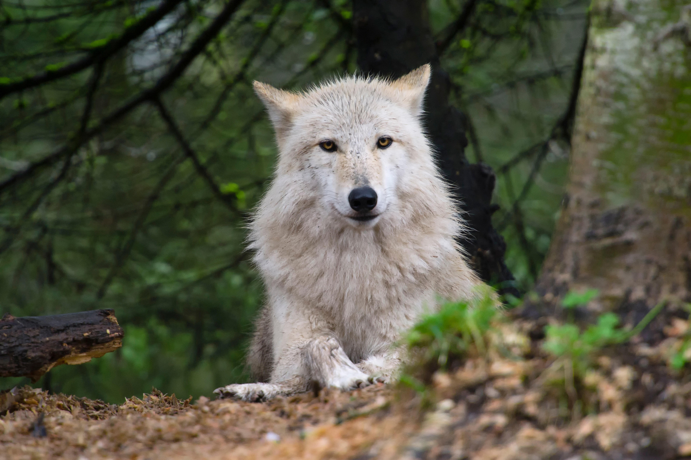

# Controversial killing of wolves continues in Washington State

STATE WILDLIFE OFFICIALS have killed the remainder of a wolf pack in eastern Washington and authorized the killing of one to two members of a nearby pack, reaffirming the state’s controversial policy of using lethal means to deal with the predators when they attack cattle.

The announcement comes after the Washington Department of Fish and Wildlife shot a female wolf on July 27 in Colville National Forest, in the state’s northeast corner. She and two other wolves made up the Wedge pack, which had killed four cattle and injured 12 in the area since April. The nearby Leadpoint pack is suspected of killing or injuring six livestock in the past 30 days.

The same day as the female’s death, the department released a statement saying it would aim to limit use of lethal controls against its state’s wolves.

After the Wedge pack’s female was killed, the pack’s two remaining wolves killed two more cattle. Not long after, the department’s director, Kelley Susewind announced the state would take lethal action against them, and on August 17, the department announced they’d been killed.

The state has now killed 34 wolves in eastern Washington in the past eight years for livestock attacks.

“We would love not to kill wolves,” says Staci Lehman, a spokesperson for the Department of Fish and Wildlife. “But there are also people whose livelihoods are impacted.”

Rancher Len McIrvin, owner of Diamond M Ranch, which lost cattle to the Wedge pack, says that “problem wolves need to be removed.” He says his business has lost more than 70 head of cattle per year since 2008 because of wolf attacks, though the state hasn’t confirmed more than 30 wolf-caused livestock mortalities a year in all of Washington during that time.

The female’s death is the latest flashpoint in the state’s fierce debate over wolf conservation. While the state wildlife agency says it’s doing what’s necessary to protect ranchers, some scientists, environmentalists, and politicians—including Governor Jay Inslee—have decried the killing on humane and ecological grounds, arguing it’s not a scientifically valid approach.

Many of those opposed to the state’s actions point to recent research suggesting non-lethal methods, such as guardian dog teams and protected livestock enclosures, which tend to be more successful at preventing future attacks than simply killing predators, says University of Wisconsin-Madison biologist, Adrian Treves. Such killings can actually lead to more livestock losses because it disrupts the pack’s social networks, leading surviving wolves to turn easier prey such as domestic animals, says Treves, who founded Carnivore Coexistence Lab, which conducts research worldwide on conflict between predators and livestock.

Some ranchers argue that using non-lethal techniques doubles their workload, adds operational costs, and only works on occasion. Still, a number of eastern Washington ranchers work proactively with the state to keep their herds safe using the non-lethal methods and rarely lose livestock, the agency says.
